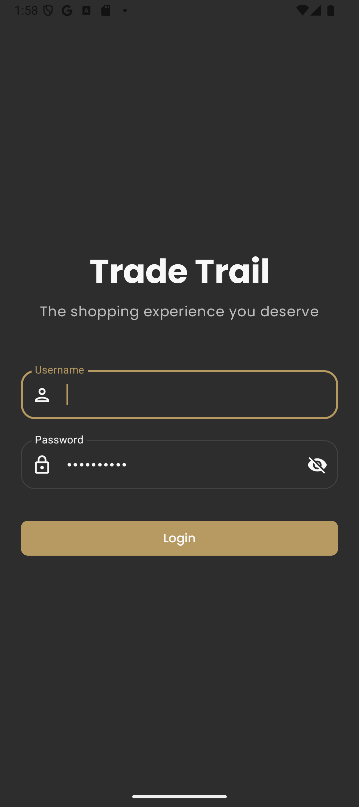

# Trade Trail 🛍️

Trade Trail is an e-commerce demo application for Android, developed as a portfolio project to showcase technical skills in modern Android development. The goal is to present a functional application that implements current best practices and tools from the Android ecosystem, serving as a showcase of my abilities for recruiters and other developers.

## ✨ Key Features

* **User Authentication:** Login screen for app access.
* **Product Catalog:** Product listing with paginated loading for smooth navigation.
* **Product Details:** Screen with detailed product information, including multiple images (carousel), description, price, and user reviews.
* **Shopping Cart:** Add products to the cart, view items, remove items, and clear the cart.
* **Checkout Process:** Order summary and a simulated checkout process with a success animation.

## 📷 Screenshots & GIFs

<table>
  <tr>
    <td align="center">
      
    </td>
    <td align="center">
      
    </td>
  </tr>
  <tr>
    <td align="center">
      
    </td>
    <td align="center">
      
    </td>
  </tr>
  <tr>
    <td colspan="2" align="center">
      
    </td>
  </tr>
</table>

## 🛠️ Tech Stack & Architecture

This project was built using a modern and robust stack, focusing on Android development best practices:

* **Language:** [Kotlin](https://kotlinlang.org/) (100% Kotlin, including Coroutines and Flow).
* **UI (User Interface):**
    * [Jetpack Compose](https://developer.android.com/jetpack/compose): For a declarative, modern, and reactive UI.
    * [Material Design 3](https://m3.material.io/): For the design system, components, and themes (light/dark).
    * **Custom Design System:** Reusable components (e.g., `TTAppBar`) and themes centralized in `core.designsystem` for visual consistency.
* **Architecture:**
    * **MVVM (Model-View-ViewModel):** Applied per feature, facilitating separation of concerns, testability, and code maintenance.
    * **Feature-based Modularization:** The code is organized into feature modules (`auth`, `catalog`, `checkout`, `product_detail`), promoting low coupling and high cohesion.
    * **Clean Architecture Inspired Principles:** Clear separation of layers (data, domain (implied through models and repositories), and presentation (features/UI)).
* **Asynchronous Programming:**
    * [Kotlin Coroutines](https://developer.android.com/kotlin/coroutines): Used extensively for asynchronous operations, improving app responsiveness.
    * [Kotlin Flow](https://developer.android.com/kotlin/flow): For reactive data streams, communication between layers (ViewModel and Repository), and observing data changes.
* **Dependency Injection:**
    * [Hilt](https://developer.android.com/training/dependency-injection/hilt-android): For dependency management throughout the application, simplifying instance provisioning and enhancing testability.
* **Navigation:**
    * [Jetpack Navigation Compose](https://developer.android.com/jetpack/compose/navigation): To manage navigation between screens in a type-safe and Compose-integrated manner.
* **Networking:**
    * [Retrofit 2](https://square.github.io/retrofit/): For efficient and type-safe communication with the REST API (DummyJSON).
    * [OkHttp 3](https://square.github.io/okhttp/): As the HTTP client, including Interceptors (`AuthInterceptor` for tokens, `HttpLoggingInterceptor` for debugging).
    * [Gson](https://github.com/google/gson): For JSON object serialization and deserialization.
* **Data Persistence:**
    * [Room](https://developer.android.com/training/data-storage/room): For local persistence of shopping cart data, ensuring items remain even after closing the app.
    * [Jetpack DataStore (Preferences DataStore)](https://developer.android.com/topic/libraries/architecture/datastore): For user session management (token, ID) and other simple preferences.
    * [Paging 3](https://developer.android.com/topic/libraries/architecture/paging/v3-overview): For efficient and gradual loading of paginated product lists in the catalog.
* **Image Loading:**
    * [Coil (Coroutine Image Loader)](https://coil-kt.github.io/coil/): For efficient and optimized image loading and caching in Jetpack Compose.
* **Animations:**
    * [Lottie](https://airbnb.io/lottie/): For vector animations, such as loading and checkout success animations, enhancing the user experience.
* **Other Jetpack Libraries:**
    * `ViewModel`: To manage UI state and presentation logic.
    * `Lifecycle`: To manage the lifecycle of components.
    * `SplashScreen API`: For a modern and compatible splash screen.

## ✨ Highlighted Skills & Modern Android Development Practices

This project demonstrates experience with various tools and concepts valued in current Android development, including:

* **Modern UI Development with Jetpack Compose & Material 3:** Proficiency in creating reactive, customizable, and efficient user interfaces using Google's latest recommendations for UI development.
* **Advanced Kotlin, Coroutines & Flow:** The application is entirely developed in Kotlin, leveraging its modern features. Coroutines and Flow are extensively used for effective management of asynchronous operations, concurrency, and reactive data streams—essential skills for contemporary Android development.
* **MVVM Architecture & Feature-based Modularization:** Adoption of the MVVM architectural pattern and a feature-modularized structure, promoting cleaner, organized, testable, easily maintainable, and scalable code. This approach is fundamental for medium to large-scale projects.
* **Dependency Injection with Hilt:** Proficient use of Hilt for managing dependencies, simplifying class coupling, and improving code testability, following Android's recommended best practices.
* **Robust and Efficient Data Management:**
    * **Networking:** Experience in integrating with RESTful APIs using Retrofit and OkHttp, including authentication handling and logging.
    * **Local Persistence:** Implementation of a local database with Room for offline functionalities and caching, such as the shopping cart.
    * **Preferences and Session:** Utilization of Jetpack DataStore for secure and efficient management of user session data.
    * **Data Pagination:** Implementation of the Paging 3 library to load and display large datasets optimally, crucial for performance and user experience in applications with extensive lists.
* **UI/UX Best Practices:** Focus on creating a fluid and intuitive user experience, with visual feedback (Lottie animations, loading states) and clear navigation.
* **State Management in Compose:** Use of `StateFlow`, `MutableState`, and other Compose state primitives to manage UI state effectively, reactively, and predictably.

## 🚀 How to Build and Run

1.  Clone this repository: `git clone https://github.com/FelipeFernandesLeandro/TradeTrail.git`
2.  Open the project in Android Studio (Giraffe | 2022.3.1 or newer recommended).
3.  Wait for Gradle sync and dependency downloads to complete.
4.  Run the application on an emulator or physical device (API 26+).

## 🌱 Next Steps & Future Enhancements

* Implementation of Unit and UI Tests to ensure code quality and robustness.
* Addition of more features (e.g., product search with filters, user profile, order history).
* Performance and accessibility optimizations.
* Exploring Jetpack Compose for Desktop/Web to expand the platform.
* Setting up a CI/CD pipeline (e.g., GitHub Actions) to automate builds and tests.

## 🧑‍💻 Author

* **Felipe Fernandes Leandro**
* **GitHub:** [https://github.com/FelipeFernandesLeandro](https://github.com/FelipeFernandesLeandro)
* **LinkedIn:** [https://www.linkedin.com/in/felipe-fernandes-leandro](https://www.linkedin.com/in/felipe-fernandes-leandro)
* **Email:** [felipe.fernandes.sjc@hotmail.com](mailto:felipe.fernandes.sjc@hotmail.com)
